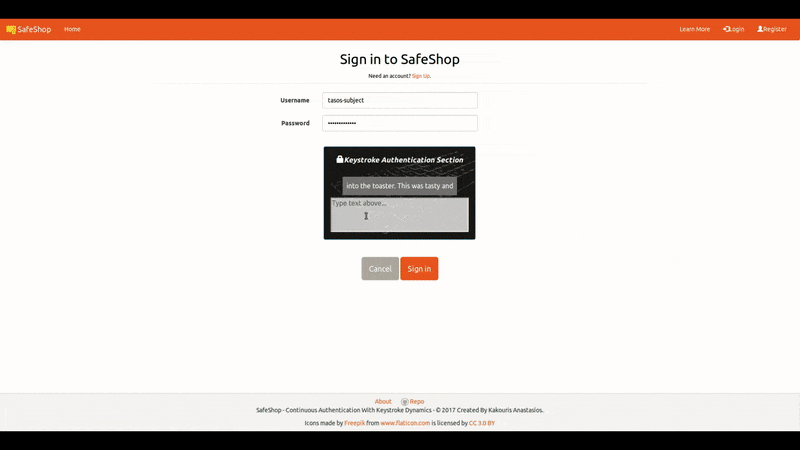

# continuous-authentication-website

 

## Description

A website to collect keystrokes and to apply the [continuous-authentication-service](https://github.com/tasoskakour/continuous-authentication-service)

### Procedure of service

- You `create an account`
- You perform the use case scenarios in order for the service to collect as many `keystrokes`
- The admin of the service `trains` the system and then a `keystroke profile` is created for you
- Every time you log-in (and after logging-in periodically), your keystrokes are collected and analyzed on server for `anomalies`. If anomalies are detected you are given a confirmation-test to prove that you are who you say you are.

## Keystroke authentication in action

## Technologies used

- `MEAN Stack`: MongoDB, Express, Angular (4) and Nodejs used for this simple web application.

## Running steps

- `npm install`
- `npm start`

Run `ng serve` for a angular dev server. Navigate to `http://localhost:4200/`. The app will automatically reload if you change any of the source files.

## Environment Variables

- `KEYSTROKE_DYNAMICS_MLAB_HOST`: Host url for mlab database
- `KEYSTROKE_DYNAMICS_MLAB_USER`: Username of mlab
- `KEYSTROKE_DYNAMICS_MLAB_PASSWORD`: Password of mlab
- `KEYSTROKE_DYNAMICS_TOKEN_SECRET`: Secret for generating jwt tokens

## Running on Heroku

The project is ready to be deployed to a Heroku dyno (as a node & python app). Just press the button above or run `heroku create` and push the code to your heroku server.
